# ħ402

<p align="center">
  
</p>

<p align="center">
  <strong>Built on x402 micropayments. No subscription, no API key. Just sign, settle, and chat.</strong><br>
  
</p>

<p align="center">
  <a href="https://h402.expo.app">Live App</a> · 
  <a href="https://hashscan.io/testnet/transaction/0x8800e6378e3db5f9fb6505528422fb41bb97e681f8256c5897843974f34bfb6a">Sample Paid Tx</a> · 
  <a href="https://www.x402.org">x402 Protocol</a>
</p>

---

## Overview

ħ402 demonstrates real, on-chain micropayments using the [x402 protocol](https://www.x402.org) on Hedera. The AI chat interface is just the demo surface — the actual product is the **payment rail** underneath.

A client hits a protected route, gets an HTTP 402 challenge, signs a USDC proof of intent via MetaMask, and the server settles on Hedera before the resource ever runs. The response carries a `PAYMENT-RESPONSE` header with a HashScan-verifiable transaction ID.

The handler behind the paywall calls an LLM for demonstration purposes, but the same x402 path can gate any API, file, tool, or resource. Provider and model are interchangeable — settlement and access control don't depend on what answers.

<p align="center">
  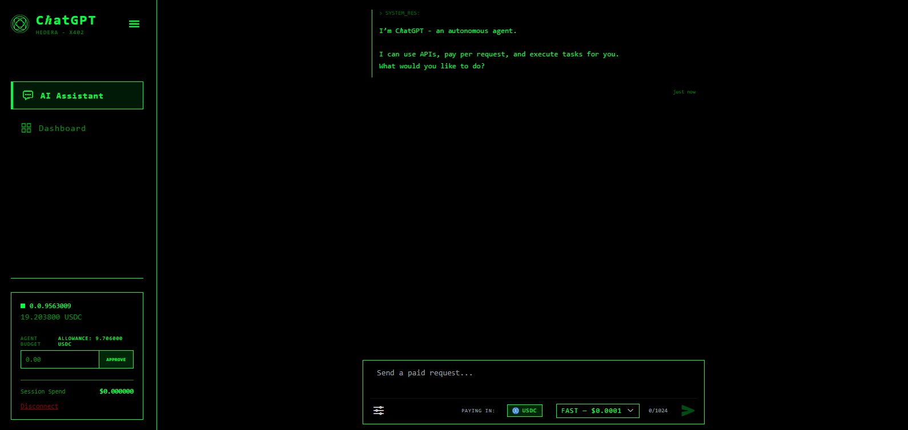
</p>

*The app after a successful USDC micropayment on Hedera. Each protected chat request settles payment before access is granted.*

---

## Architecture

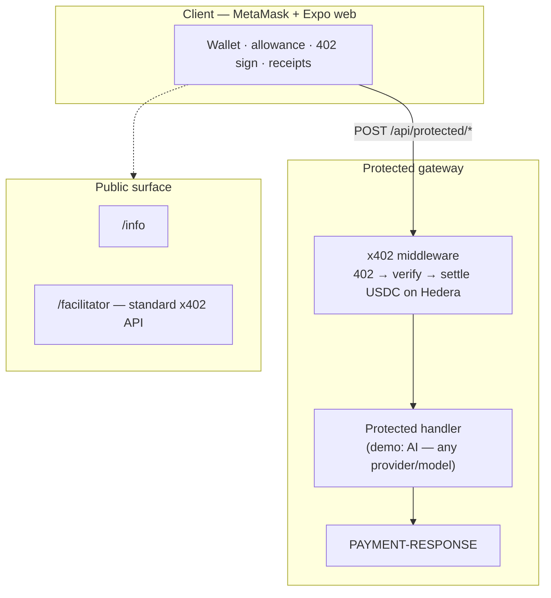

Everything lives in one app — wallet connection, x402 payment gate, and Hedera settlement. The AI chat is just a demo behind the paywall; swap it for any API or resource.

---

## Payment Flow

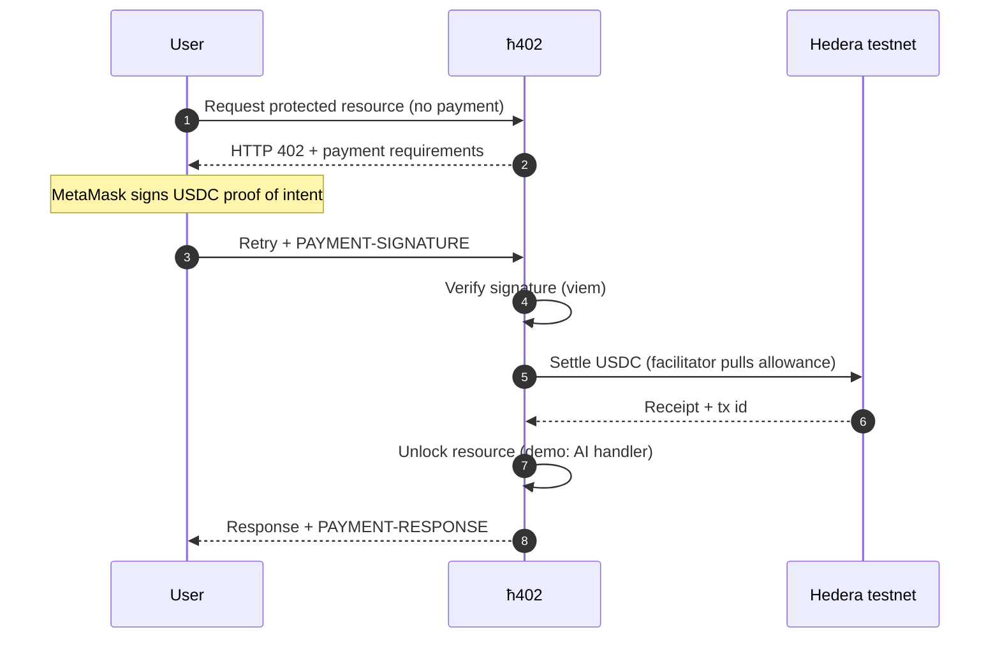

**Step by step:**

1. Connect your wallet (MetaMask on Hedera EVM testnet, chain `296`)
2. Approve a USDC allowance — this is your **Agent Budget**
3. Call a protected route → server responds with **HTTP 402** (quotes both HBAR and USDC; client pays USDC)
4. Sign the proof of intent in MetaMask
5. Server verifies the signature → **settles on Hedera**
6. Resource runs, you get the result plus an on-chain receipt

---

## Why Hedera × x402

[x402](https://www.x402.org) turns HTTP `402 Payment Required` into a standard for machine-payable HTTP — charge per request in stablecoins, no accounts or invoices needed.

Most x402 demos stop at gating sample JSON behind a 402 response. That shows wiring, not a usable micropayment economy.

**Hedera makes that economy practical.** Fixed, tiny fees and fast finality mean a $0.0001 request can settle on-chain and still make economic sense.

What sets this project apart from scaffold demos:

- **Full client payment UX** — MetaMask connection, allowance management, 402 handling, and on-chain receipts, not just a protocol hello-world
- **First-party settlement** — the facilitator settles USDC in the same request that unlocks the resource, no remote black-box hop
- **Live pricing** — USD → HBAR oracle conversion plus USDC at 6-decimal precision, not hardcoded demo amounts
- **Public audit trail** — every paid call has a HashScan-verifiable transaction, not local logs as "proof"

**Bottom line:** x402 is *how* you charge per request. Hedera is *why* micropayments work. ħ402 is that loop running in a live app.

---

## On-Chain Proof

Every payment is publicly verifiable on HashScan:

| Role | Account | Link |
|---|---|---|
| Facilitator | `0.0.9572127` | [View on HashScan](https://hashscan.io/testnet/account/0.0.9572127) |
| Revenue (seller) | `0.0.9563009` | [View on HashScan](https://hashscan.io/testnet/account/0.0.9563009) |
| Testnet USDC | `0.0.429274` | [View on HashScan](https://hashscan.io/testnet/token/0.0.429274) |

<p align="center">
  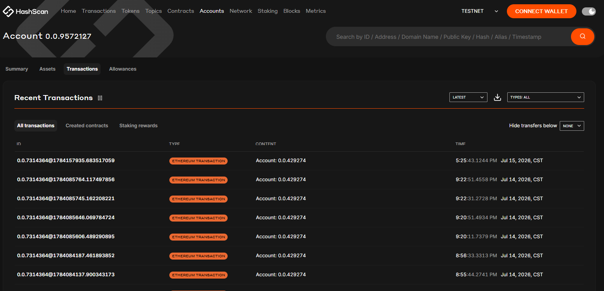
</p>

*A HashScan CRYPTOTRANSFER for a paid request — on-chain proof that each protected call settles USDC before access is granted. [View on HashScan →](https://hashscan.io/testnet/account/0.0.9572127/operations?pa=1&pr=1)*

---

## Using the DApp

The UI is a chat so anyone can feel the payment flow end-to-end — it's not an AI model showcase.

### 1 · Connect & Fund

Connect your MetaMask wallet to the Hedera EVM testnet (chain `296`):

<p align="center">
  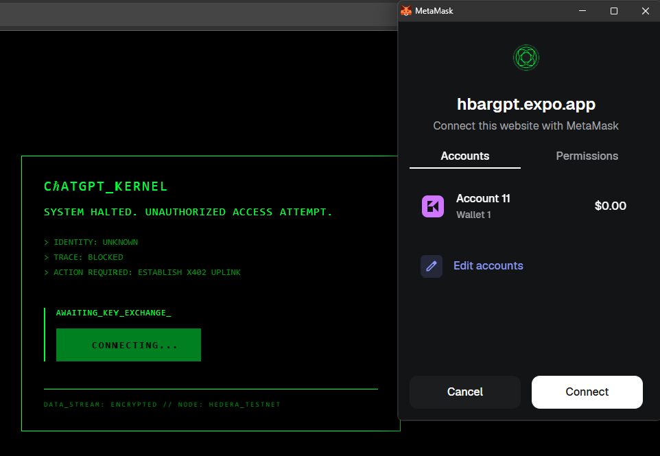
</p>

Verify your USDC balance on testnet:

<p align="center">
  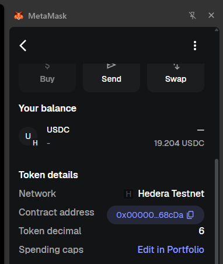
</p>

Then set an **Agent Budget** — an ERC-20 allowance that caps how much the facilitator can pull from your USDC Balance. Every request is authorized, and your exposure stays within what you approve.

<p align="center">
  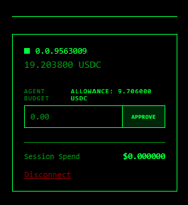
</p>

### 2 · Choose a Price Band

Tiers are x402 price bands for the same payment path. Enabling optional tools raises the band. Which model answers is incidental.

| Band | Base | With Tools |
|---|---|---|
| Fast | $0.0001 | $0.0004 |
| Smart | $0.001 | $0.003 |
| Powerful | $0.01 | $0.03 |

<p align="center">
  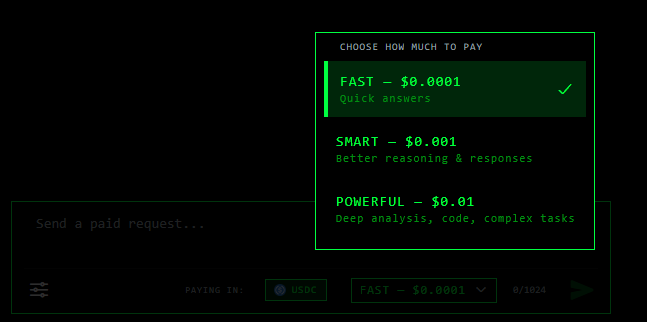
</p>

### 3 · Send a Prompt & Pay

Send a message — the app starts the payment workflow before unlocking a reply. Sign the USDC authorization in MetaMask for that request.

<p align="center">
  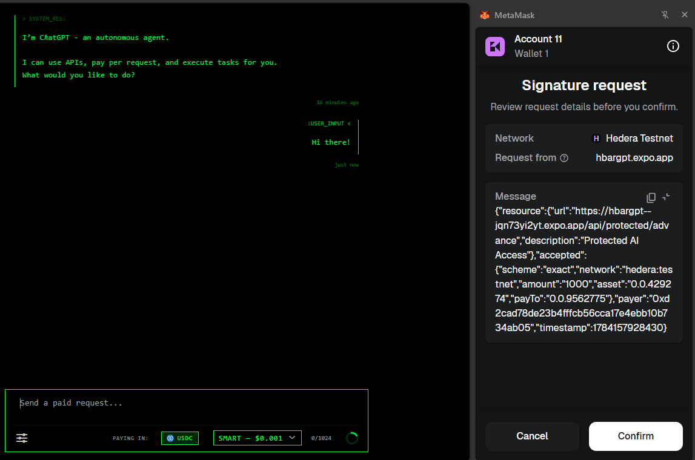
</p>

Once payment settles, the reply unlocks with a **Payment Verified** badge and a HashScan link. 

- [View sample transaction →](https://hashscan.io/testnet/transaction/0x8800e6378e3db5f9fb6505528422fb41bb97e681f8256c5897843974f34bfb6a)

<p align="center">
  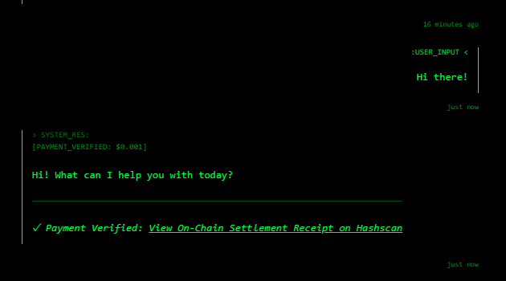
</p>

### 4 · Dashboard

Track your spend, reply history, facilitator health, and per-reply HashScan receipts.

<p align="center">
  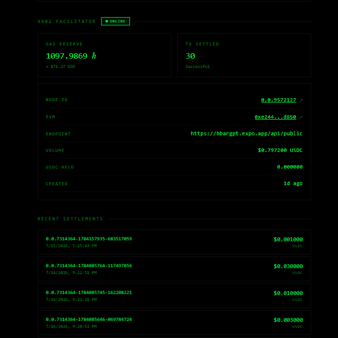
</p>

---

## Technical Deep Dive

This section explains how ħ402 works under the hood — how the x402 middleware enforces payment, how settlement executes on Hedera, and why the architecture differs from existing x402 reference implementations.

### x402 Middleware Pipeline

The core of the project is [`x402.js`](dapp/src/api/protected/middleware/x402.js), a Hono middleware factory that wraps any protected route. It enforces a strict 6-step pipeline — if any step fails, the resource handler never executes.

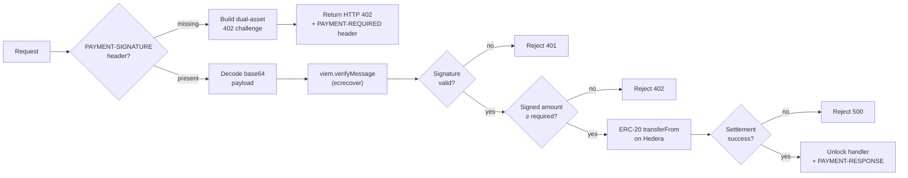

**Step 1–2: The 402 Challenge.** When a request arrives without a `PAYMENT-SIGNATURE` header, the middleware calculates the price in two assets — HBAR (via live Mirror Node exchange rate) and USDC (direct 6-decimal conversion) — and returns both in the `accepts` array of a standard x402 `requirements` object. The response is also base64-encoded into a `PAYMENT-REQUIRED` header for clients that prefer header-based parsing.

> [`x402.js` L31–86](https://github.com/altaga/h402/blob/main/dapp/src/api/protected/middleware/x402.js#L31-L86) — Dynamic pricing + 402 challenge construction:

```javascript
// 💱 DYNAMIC PRICING: Calculate HBAR and USDC values
const hbarAmountRequired = await usdToTinybars(activeUsdAmount);
const usdcAmountRequired = usdToUsdcBase(activeUsdAmount);

const requirements = {
  x402Version: 2,
  accepts: [
    { scheme: "exact", network, amount: hbarAmountRequired, asset: "HBAR", payTo: payToAccount },
    { scheme: "exact", network, amount: usdcAmountRequired, asset: usdcTokenId, payTo: payToAccount }
  ],
};

// No signature → Issue 402 Challenge
if (!paymentSignature) {
  const encodedReq = Buffer.from(JSON.stringify(requirements)).toString("base64");
  c.header("PAYMENT-REQUIRED", encodedReq);
  return c.json(requirements, 402);
}
```

**Step 3–5: Signature Verification.** The client's signed payload is base64-decoded and parsed. The middleware uses `viem.verifyMessage` to cryptographically verify that the `payer` address actually signed the `message` via EVM `ecrecover`. It then cross-references the signed asset and amount against the `requirements.accepts` array — if the signed amount is less than what the server requires, the request is rejected with a 402 before any settlement is attempted.

> [`x402.js` L89–143](https://github.com/altaga/h402/blob/main/dapp/src/api/protected/middleware/x402.js#L89-L143) — Decode, verify, and validate:

```javascript
// Decode the base64 payment payload
const decoded = JSON.parse(Buffer.from(paymentSignature, "base64").toString("utf8"));
const { payload } = decoded;

// Cryptographic Verification (EVM ecrecover)
const isValid = await verifyMessage({
  address: payload.payer,
  message: payload.message,
  signature: payload.signature,
});

// Cross-reference signed amount against server requirements
const signedData = JSON.parse(payload.message);
const requirement = requirements.accepts.find(a => a.asset === signedData.accepted?.asset);
if (Number(signedData.accepted?.amount) < Number(requirement.amount)) {
  return c.json({ error: "Signed amount is less than required." }, 402);
}
```

**Step 6: On-Chain Settlement.** This is where ħ402 diverges from most x402 demos. Instead of forwarding payment to an external facilitator service, the middleware itself holds a facilitator ECDSA key and executes the ERC-20 `transferFrom` directly on Hedera via the Hashio JSON-RPC relay.

> [`x402.js` L145–207](https://github.com/altaga/h402/blob/main/dapp/src/api/protected/middleware/x402.js#L145-L207) — On-chain EVM settlement:

```javascript
// Derive the facilitator's EVM wallet from the Hedera ECDSA key
const facilitatorKey = PrivateKey.fromStringECDSA(process.env.FACILITATOR_PRIVATE_KEY);
const facilitatorAccount = privateKeyToAccount(`0x${facilitatorKey.toStringRaw()}`);

const walletClient = createWalletClient({
  account: facilitatorAccount,
  chain: hederaTestnet,
  transport: http("https://testnet.hashio.io/api")
});

// The facilitator's own key pulls pre-approved USDC from the payer
const hash = await walletClient.writeContract({
  address: usdcEvmAddress,    // USDC token on Hedera (0.0.429274)
  abi: parseAbi(['function transferFrom(address sender, address recipient, uint256 amount) returns (bool)']),
  functionName: 'transferFrom',
  args: [payload.payer, payToEvm, BigInt(requiredAmount)]
});
```

The `writeContract` call from `viem` automatically simulates the transaction before submitting, which validates allowance and balance on-chain. A successful hash return means Hedera consensus is practically guaranteed — the middleware does **not** poll for a receipt afterward, which is a deliberate optimization to avoid Hashio's Cloudflare subrequest limits on Vercel.

Once the on-chain transfer succeeds, the middleware calls `next()` to run the protected handler (e.g., the AI agent). After the handler produces a response, the settlement receipt — including the transaction hash — is appended as a `PAYMENT-RESPONSE` header so the client can link directly to HashScan.

> [`x402.js` L214–220](https://github.com/altaga/h402/blob/main/dapp/src/api/protected/middleware/x402.js#L214-L220) — Post-settlement header injection:

```javascript
// Payment cleared → Proceed to route handler
await next();

// Add the settlement receipt header AFTER the route handler generates the Response
if (encodedResponse) {
  c.res.headers.append("PAYMENT-RESPONSE", encodedResponse);
}
```

### First-Party Settlement vs. External Facilitator

Most x402 implementations split the system into a separate facilitator microservice. ħ402 runs **two settlement paths simultaneously**:

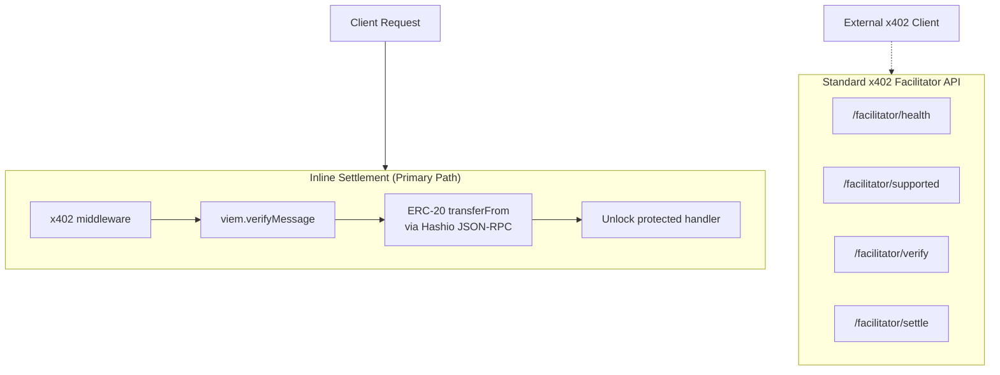

**1. Inline settlement (primary).** The x402 middleware in [`x402.js`](dapp/src/api/protected/middleware/x402.js) settles USDC in the same HTTP request cycle that unlocks the resource. The facilitator's ECDSA private key is derived via `@hashgraph/sdk`'s `PrivateKey.fromStringECDSA`, converted to a raw hex key, and used to create a `viem` wallet client against `hederaTestnet`. This means settlement latency is bounded by a single Hedera consensus round — there's no extra network hop to a remote facilitator.

**2. Standard facilitator API (interoperability).** A full x402-compliant facilitator surface is mounted at [`/api/facilitator/`](dapp/src/app/api/public/facilitator/) using `@x402/core` and `@x402/hedera`. It exposes four endpoints — `health`, `supported`, `verify`, and `settle` — so external clients can orchestrate payments through the standard x402 protocol.

> [`[...route]+api.js` L40–49](https://github.com/altaga/h402/blob/main/dapp/src/app/api/public/facilitator/%5B...route%5D%2Bapi.js#L40-L49) — Official x402 facilitator registration:

```javascript
const signer = toFacilitatorHederaSigner({
  getAddresses: () => [FEE_PAYER_ID],
  signAndSubmitTransaction: createHederaSignAndSubmitTransaction(buildClient, FEE_PAYER_KEY),
  preflightTransfer: createHederaPreflightTransfer(buildClient),
});

facilitator = new x402Facilitator().register(
  NETWORK,
  new ExactHederaScheme(signer, { aliasPolicy: "reject" })
);
```

The dual architecture means ħ402 doesn't depend on an external service for its own payments, while still offering protocol interoperability for any x402-aware client.

### Dynamic Exchange Rate Oracle

The 402 challenge quotes prices in both HBAR and USDC. HBAR pricing uses a live exchange rate from the Hedera Mirror Node.

> [`exchange.js` L11–46](https://github.com/altaga/h402/blob/main/dapp/src/api/protected/utils/exchange.js#L11-L46) — Live rate fetch with 5-minute cache:

```javascript
const mirrorNode = network === "mainnet"
  ? "https://mainnet-public.mirrornode.hedera.com"
  : "https://testnet.mirrornode.hedera.com";

const response = await fetch(`${mirrorNode}/api/v1/network/exchangerate`);
const data = await response.json();

// Rate: 1 HBAR (in tinybars) / hbar_equivalent * cent_equivalent = cents
const usdPerHbar = (data.current_rate.cent_equivalent / 100) / data.current_rate.hbar_equivalent;
```

With the live rate cached, two conversion functions translate a USD price into the on-chain units each asset requires — tinybars for HBAR (8 decimals) and base units for USDC (6 decimals). Both values are embedded in the 402 challenge to demonstrate x402 protocol flexibility, though this specific facilitator implementation exclusively settles in USDC (since it relies on pulling from an ERC-20 allowance).

> [`exchange.js` L54–70](https://github.com/altaga/h402/blob/main/dapp/src/api/protected/utils/exchange.js#L54-L70) — USD to tinybars and USDC base unit conversion:

```javascript
// USD → tinybars (1 HBAR = 100,000,000 tinybars)
export const usdToTinybars = async (usdAmount) => {
  const rate = await getHbarUsdRate();
  const tinybars = Math.floor((parseFloat(usdAmount) / rate) * 100000000);
  return tinybars.toString();
};

// USD → USDC base units (6 decimals: $1.00 = 1,000,000)
export const usdToUsdcBase = (usdAmount) => {
  return Math.floor(parseFloat(usdAmount) * 1000000).toString();
};
```

### Client-Side 402 Negotiation

The client-side x402 flow lives in [`chat.js`](dapp/src/components/chat.js) inside a `fetchWithPay` wrapper that intercepts HTTP responses.

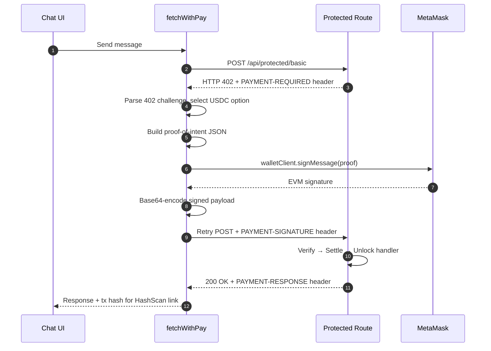

> [`chat.js` L267–361](https://github.com/altaga/h402/blob/main/dapp/src/components/chat.js#L267-L361) — Full `fetchWithPay` implementation:

```javascript
const fetchWithPay = useCallback(async (url, options = {}) => {
  // Step 1: Make the initial request
  const initialResponse = await fetch(url, options);

  // Step 2: If not 402, return as-is
  if (initialResponse.status !== 402) return initialResponse;

  // Step 3: Parse the 402 challenge
  const paymentRequiredHeader = initialResponse.headers.get("PAYMENT-REQUIRED");
  const requirements = paymentRequiredHeader
    ? JSON.parse(atob(paymentRequiredHeader))
    : await initialResponse.json();

  // Step 4: Pick the USDC payment option
  let accepted = requirements.accepts?.find(a => a.asset !== "HBAR");

  // Step 5: Sign a proof-of-intent message with MetaMask
  const proofMessage = JSON.stringify({
    resource: requirements.resource,
    accepted: { scheme: accepted.scheme, network: accepted.network,
                amount: accepted.amount, asset: accepted.asset, payTo: accepted.payTo },
    payer: account,
    timestamp: Date.now(),
  });
  const signature = await walletClient.signMessage({ account, message: proofMessage });

  // Step 6: Retry with signed payment proof
  const encodedPayment = btoa(unescape(encodeURIComponent(JSON.stringify({
    x402Version: 2, scheme: accepted.scheme, network: accepted.network,
    payload: { signature, payer: account, message: proofMessage },
  }))));

  return fetch(url, { ...options, headers: { ...options.headers, "PAYMENT-SIGNATURE": encodedPayment } });
}, [walletClient, account]);
```

### Agent Budget (ERC-20 Allowance)

Before any payment can settle, the user must approve an ERC-20 allowance — what the app calls an **Agent Budget**. The UI calls `approve(facilitatorAddress, amount)` on the USDC contract via MetaMask.

> [`smartProvider.js` L78–100](https://github.com/altaga/h402/blob/main/dapp/src/providers/smartProvider.js#L78-L100) — Allowance approval flow:

```javascript
const handleApproveBudget = async () => {
  const amount = parseUnits(budgetInput, 6); // USDC has 6 decimals
  const FACILITATOR_EVM = "0xe244adba23d2e84a48176de1eb0740bde27ed850"; // Maps to 0.0.9572127
  const USDC_EVM = "0x0000000000000000000000000000000000068cda";

  const abi = parseAbi(['function approve(address spender, uint256 amount) returns (bool)']);
  const data = encodeFunctionData({ abi, functionName: 'approve', args: [FACILITATOR_EVM, amount] });

  await sendTransaction({ to: USDC_EVM, data, value: 0n });
};
```

This caps total exposure — the facilitator can only pull USDC up to the approved amount. Each micropayment (as low as $0.0001 = 100 base units) deducts from this allowance. The user can revoke or adjust it at any time.

### Agentic Tool Loop

Behind the x402 paywall, the protected handlers run an agentic AI loop that supports multi-turn tool use.

> [`agent-handler.js` L50–100](https://github.com/altaga/h402/blob/main/dapp/src/api/protected/utils/agent-handler.js#L50-L100) — Multi-turn loop with parallel tool execution:

```javascript
while (iteration < maxIterations) {
  iteration++;

  // Perform ONE LLM Turn
  const turn = await agent.invoke(currentMessages, config);
  currentMessages.push(turn.message);

  // If no tool calls, we have the final response
  if (turn.toolCalls.length === 0) {
    finalContent = turn.content;
    break;
  }

  // Execute Tools Independently (PARALLELIZED)
  const toolResults = await Promise.all(turn.toolCalls.map(async (toolCall) => {
    const tool = ALL_TOOLS.find(t => t.name === toolCall.function.name);
    const result = tool ? await tool.execute(JSON.parse(toolCall.function.arguments)) : `Tool not found.`;
    return { type: "tool_result", tool_use_id: toolCall.id, content: JSON.stringify(result) };
  }));

  // Inject tool results back into conversation for next LLM turn
  for (const res of toolResults) {
    currentMessages.push({ role: "tool", tool_call_id: res.tool_use_id, content: res.content });
  }
}
```

Three tools are available when enabled via the `X-Tools-Enabled` header:
- **[`web_search`](https://github.com/altaga/h402/blob/main/dapp/src/api/protected/utils/tools.js#L11-L54)** — Yahoo Finance news + Wikipedia fallback
- **[`finance_quote`](https://github.com/altaga/h402/blob/main/dapp/src/api/protected/utils/tools.js#L57-L102)** — real-time stock/crypto data via Yahoo Finance (with a local top-50 cache)
- **[`get_weather`](https://github.com/altaga/h402/blob/main/dapp/src/api/protected/utils/tools.js#L105-L132)** — current conditions via Open-Meteo

Enabling tools raises the x402 price band (e.g., $0.0001 → $0.0004 for the Fast tier) — same settlement path, higher price for more compute.

### Wallet Provider Architecture

The wallet layer ([`walletProvider.js`](dapp/src/providers/walletProvider.js)) handles the full MetaMask lifecycle on Hedera EVM testnet.

> [`walletProvider.js` L34–54](https://github.com/altaga/h402/blob/main/dapp/src/providers/walletProvider.js#L34-L54) — Custom Hedera testnet chain definition:

```javascript
const hederaTestnet = defineChain({
  id: 296,
  name: "Hedera Testnet",
  nativeCurrency: { decimals: 18, name: "HBAR", symbol: "HBAR" },
  rpcUrls: { default: { http: ["https://testnet.hashio.io/api"] } },
  blockExplorers: { default: { name: "Hashscan", url: "https://hashscan.io/testnet" } },
  testnet: true,
});
```

With the chain defined, the provider resolves the user's balances through two separate sources. Native HBAR comes from a standard JSON-RPC `eth_getBalance` call, while USDC is fetched from the Hedera Mirror Node's token balance API — which is more reliable than calling `balanceOf` via ERC-20 on testnet.

> [`walletProvider.js` L109–149](https://github.com/altaga/h402/blob/main/dapp/src/providers/walletProvider.js#L109-L149) — Dual balance resolution (HBAR via JSON-RPC, USDC via Mirror Node):

```javascript
// 1. Native HBAR Balance (via JSON-RPC)
const balanceWei = await client.getBalance({ address: walletAddress });

// 2. USDC Balance (Hedera Mirror Node — more reliable than ERC-20 balanceOf on testnet)
const mirrorRes = await fetch(`https://testnet.mirrornode.hedera.com/api/v1/accounts/${walletAddress}`);
const mirrorData = await mirrorRes.json();
const usdcToken = mirrorData.balance.tokens.find(t => t.token_id === "0.0.429274");
const hederaUsdcBalance = (usdcToken.balance / 1000000).toFixed(6); // 6-decimal USDC
```

When the user first connects, the provider ensures MetaMask is on the correct network. If Hedera testnet (chain `296`) isn't the active chain, it requests a switch. If the chain isn't configured in MetaMask at all, it adds it automatically with the correct RPC URL, currency, and block explorer.

> [`walletProvider.js` L157–213](https://github.com/altaga/h402/blob/main/dapp/src/providers/walletProvider.js#L157-L213) — Auto-switch to Hedera testnet or add the chain if missing:

```javascript
// Ensure MetaMask is on Hedera Testnet (chainId 296 = 0x128)
try {
  await window.ethereum.request({
    method: "wallet_switchEthereumChain",
    params: [{ chainId: "0x128" }],
  });
} catch (switchError) {
  if (switchError.code === 4902) {
    await window.ethereum.request({
      method: "wallet_addEthereumChain",
      params: [{ chainId: "0x128", chainName: "Hedera Testnet",
                 nativeCurrency: { name: "HBAR", symbol: "HBAR", decimals: 18 },
                 rpcUrls: ["https://testnet.hashio.io/api"] }],
    });
  }
}
```

### Price Bands and Route Architecture

Each pricing tier maps to a separate Hono sub-app with its own `requirePayment` middleware invocation:

| Route | Base | With Tools | Model |
|---|---|---|---|
| [`/api/protected/basic`](https://github.com/altaga/h402/blob/main/dapp/src/api/protected/handlers/basic.js) | $0.0001 | $0.0004 | MiniMax-M3 |
| [`/api/protected/advance`](https://github.com/altaga/h402/blob/main/dapp/src/api/protected/handlers/advance.js) | $0.001 | $0.003 | MiniMax-M3 |
| [`/api/protected/expert`](https://github.com/altaga/h402/blob/main/dapp/src/api/protected/handlers/expert.js) | $0.01 | $0.03 | MiniMax-M3 |

> [`basic.js` L10–12](https://github.com/altaga/h402/blob/main/dapp/src/api/protected/handlers/basic.js#L10-L12) — Declarative payment gating in one line:

```javascript
// requirePayment(baseUsd, toolUsd) → x402 middleware wraps the handler
basicApp.post('/', requirePayment("0.0001", "0.0004"), (c) =>
  handleAgentRequest(c, "Basic", "MiniMax-M3", systemPrompt)
);
```

The `requirePayment(baseUsd, toolUsd)` factory reads the `X-Tools-Enabled` header to select the active price. All tiers share the same x402 middleware, the same settlement path, and the same facilitator key. The only variable is the dollar amount in the 402 challenge.

**Note on models and tools:** The current model assignment (MiniMax-M3) and the three bundled tools are proof-of-concept choices to demonstrate the payment flow end-to-end. The architecture is fully model-agnostic — swapping in more capable models, adding more tools, or changing providers requires only editing the handler file. The point of this project is not which AI model answers; it's that **every request settles USDC on Hedera via x402 before any model runs**. The AI layer is the demo surface. The payment rail is the product.

---

## Security Model

| Layer | Implementation |
|---|---|
| **Wallet custody** | User signs with MetaMask — the app never touches private keys |
| **Signature verification** | Every paid request verified via [`viem.verifyMessage`](https://github.com/altaga/h402/blob/main/dapp/src/api/protected/middleware/x402.js#L107-L111) (EVM ecrecover) |
| **Amount validation** | Signed amount [cross-referenced](https://github.com/altaga/h402/blob/main/dapp/src/api/protected/middleware/x402.js#L127-L143) against server-side requirements before settlement |
| **Settlement authorization** | Facilitator can only pull pre-approved USDC via ERC-20 [`transferFrom`](https://github.com/altaga/h402/blob/main/dapp/src/api/protected/middleware/x402.js#L177-L182) (allowance-gated) |
| **On-chain finality** | Every settlement is a real Hedera transaction with a [HashScan-verifiable](https://hashscan.io/testnet/account/0.0.9572127) tx hash |
| **No replay** | Each [proof-of-intent](https://github.com/altaga/h402/blob/main/dapp/src/components/chat.js#L307-L318) includes a timestamp and resource URL — stale or mismatched proofs are rejected |

---

## Quick Start

1. Open **[h402.expo.app](https://h402.expo.app)**
2. Connect MetaMask (Hedera testnet)
3. Approve an Agent Budget in USDC
4. Send a paid request — complete the 402 → sign → settle flow
5. Open the receipt on HashScan

---

## Key Files

| File | Purpose |
|---|---|
| [`x402.js`](dapp/src/api/protected/middleware/x402.js) | x402 middleware — 402 challenge, signature verification, on-chain settlement |
| [`exchange.js`](dapp/src/api/protected/utils/exchange.js) | Live HBAR/USD oracle via Hedera Mirror Node |
| [`facilitator/`](dapp/src/app/api/public/facilitator/) | Standard x402 facilitator API (health, verify, settle) |
| [`walletProvider.js`](dapp/src/providers/walletProvider.js) | MetaMask connection, chain management, balance resolution |
| [`smartProvider.js`](dapp/src/providers/smartProvider.js) | Agent Budget (ERC-20 allowance) management |
| [`chat.js`](dapp/src/components/chat.js) | Client-side 402 negotiation (`fetchWithPay`) and payment UX |
| [`agent-handler.js`](dapp/src/api/protected/utils/agent-handler.js) | Multi-turn agentic tool loop behind the paywall |
| [`tools.js`](dapp/src/api/protected/utils/tools.js) | Web search, finance, and weather tool definitions |
| [`.env.example`](dapp/.env.example) | Configuration reference |

---

## License

MIT — see [LICENSE](./LICENSE).

<br>

<p align="center"><em>Testnet only · Real x402 USDC settlements on Hedera · Every paid request is independently verifiable on HashScan</em></p>
