# ℏ402: API Monetization on Hedera

**ℏ402** is an adaptation of the **x402** protocol specifically engineered for the **Hedera network**. It provides the financial primitives for a **Machine-to-Machine (M2M) economy**, enabling AI Agents to autonomously negotiate and pay for resources in real-time using USDC.

---

## 🤖 The AI & M2M Economy

In a world increasingly populated by autonomous AI agents, the ability for machines to trade value without human intervention is critical. **ℏ402** transforms APIs from passive tools into active economic participants.

-   **Autonomous Consumption**: AI agents can discover, negotiate, and pay for API access dynamically.
-   **Granular Monetization**: Infrastructure providers can charge per-request, ensuring perfect alignment between value and cost.
-   **Low-Trust Environments**: Cryptographic proofs ensure that agents only pay for what they use, and servers only provide data for verified payments.

---

## 🏗 Architecture Overview

The system is composed of three primary actors, working in concert to facilitate trustless API access:

1.  **The Resource Server (API Provider)**: Protects endpoints using the `x402-express` middleware. It defines the price and the destination wallet for payments.
2.  **The Facilitator (Payment Engine)**: A trusted node that verifies client payment capability and issues cryptographic proofs of payment.
3.  **The Client (Consumer)**: Uses `x402-fetch` to automatically negotiate payments when encountering a `402 Payment Required` response.

---

## ⚡ Hedera Adaptation (Why ℏ402?)

While the standard `x402` protocol often relies on **EIP-3009** (Gasless transfers via signatures/permits), Hedera's native USDC implementation and EVM precompiles currently have specific constraints regarding signature-based transfers.

### The "Manual Settlement" Workaround
To ensure compatibility with Hedera's infrastructure, **ℏ402** implements a **Manual Settlement Flow**:

-   **Pre-Approval**: The Client grants a USDC `allowance` to the Facilitator.
-   **Background Execution**: Instead of the Client sending the transaction, the Facilitator executes a `transferFrom` call in the background upon verifying a valid client signature.
-   **Immediate Access**: The Facilitator provides the "Payment Token" to the client *immediately* after initiating the on-chain transfer, ensuring low-latency API responses while the transaction settles on Hedera.

---

## 📊 Interaction Flow

The following diagram illustrates the lifecycle of a paid request in the ℏ402 ecosystem:

```mermaid
%%{init: {
  'theme': 'base',
  'themeVariables': {
    'primaryColor': '#000000',
    'primaryTextColor': '#ffffff',
    'primaryBorderColor': '#ffffff',
    'lineColor': '#ffffff',
    'secondaryColor': '#000000',
    'tertiaryColor': '#000000',
    'mainBkg': '#000000',
    'nodeBorder': '#ffffff',
    'clusterBkg': '#000000',
    'titleColor': '#ffffff',
    'actorBkg': '#000000',
    'actorTextColor': '#ffffff',
    'actorBorder': '#ffffff',
    'signalColor': '#ffffff',
    'signalTextColor': '#ffffff',
    'labelTextColor': '#ffffff',
    'loopTextColor': '#ffffff',
    'noteBkgColor': '#000000',
    'noteTextColor': '#ffffff',
    'sequenceNumberColor': '#ffffff'
  }
} }%%
sequenceDiagram
    participant C as Client
    participant S as Resource Server
    participant F as Facilitator
    participant H as Hedera Network

    Note over C: fetch("/weather")
    C->>S: GET /weather
    S-->>C: 402 Payment Required<br/>(Price: 0.001 USDC, Facilitator URL)
    
    rect rgb(30, 30, 30)
    Note right of C: Payment Negotiation
    C->>F: POST /verify (Signed Intent)
    F->>F: Verify Balance & Allowance
    F->>C: 200 OK (Payment Signature)
    
    Note over F, H: Background Settlement
    F->>H: transferFrom(Client, Provider, Amount)
    end

    C->>S: GET /weather + Payment Signature
    S->>S: Verify Signature
    S-->>C: 200 OK (Resource Data)
    Note over C: { "weather": "sunny" }
```

---

## 🛠 Technical Specifications

| Parameter | Value |
| :--- | :--- |
| **Network** | Hedera Mainnet (EVM) |
| **Asset** | USDC (Bridged/Native) |
| **Contract Address** | `0x000000000000000000000000000000000006f89a` |
| **Decimals** | 6 |
| **Settlement Mode** | Asynchronous `transferFrom` |

---

## 📂 Project Structure

-   `x402 - Client`: Wrapper implementation using `x402-fetch`.
-   `x402 - Facilitator`: The settlement engine handling Hedera-specific `transferFrom` logic.
-   `x402 - Server`: Example API provider protected by `x402-express`.

---

## 🚀 Getting Started

1.  **Configure Wallets**: Set up EVM-compatible private keys for the Server, Client, and Facilitator.
2.  **Approve Spender**: Ensure the Client wallet has approved the Facilitator address for USDC spending on Hedera.
3.  **Start Services**: Run the Facilitator, then the Server, and finally execute the Client request.

---
*Built for the Hedera Ecosystem. ℏ402 - The Future of API Monetization.*
